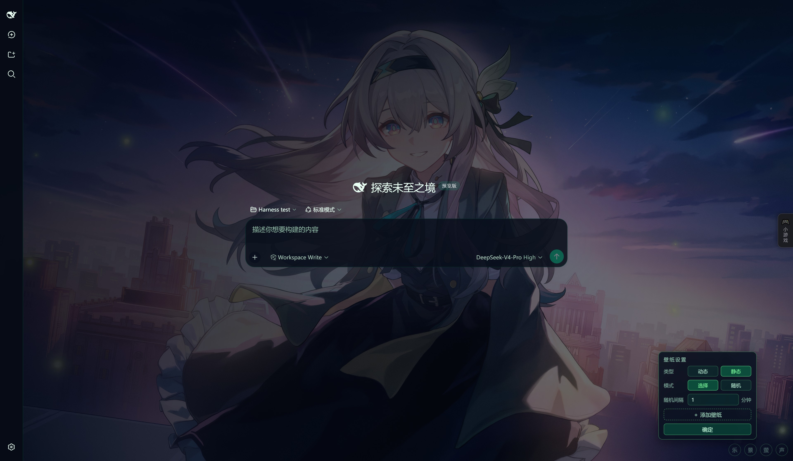
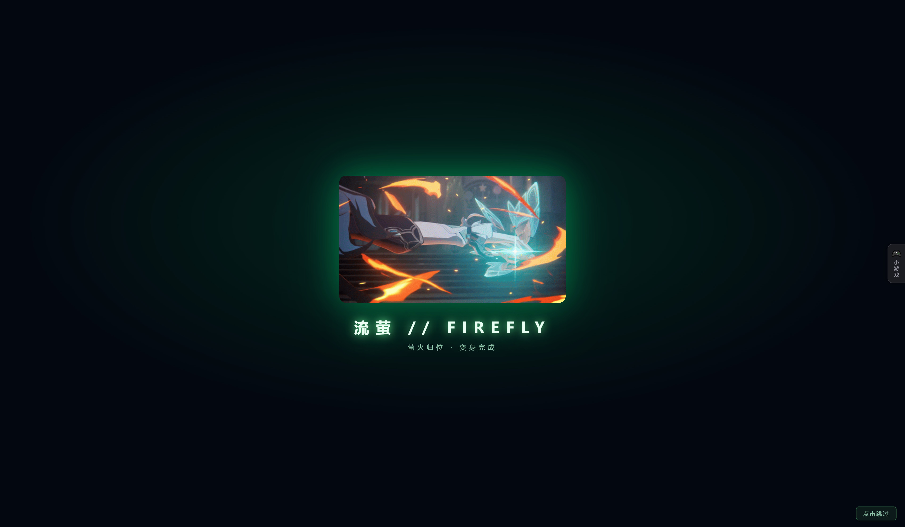
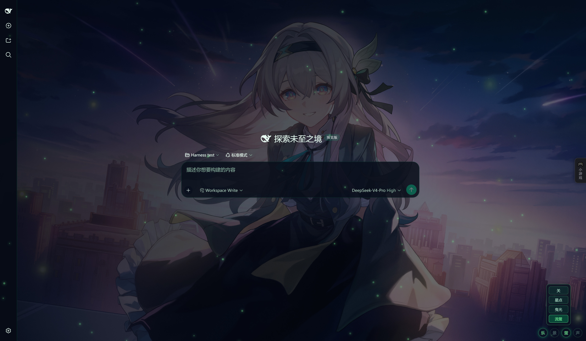
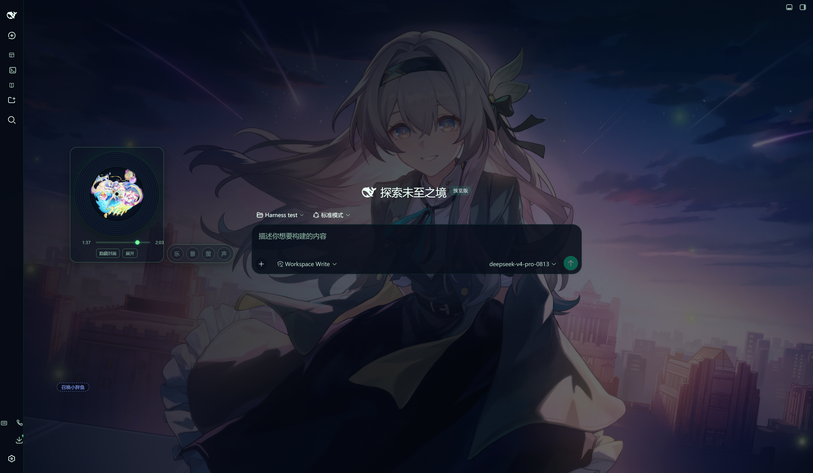

# dsh-theme-mediascape · 媒体景观主题

> 🌌 以崩坏：星穹铁道「流萤」素材为灵感的 **DeepSeek Harness Web UI** 媒体景观主题插件。
> 萤火绿霓虹配色 × 立绘/动态壁纸 × 开屏变身动画 × 萤火氛围粒子 × 背景音乐 × 打字音效。

让流萤的萤火为你点亮DSH。✨

## 🖼️ 预览与演示

### 动态 / 静态壁纸



### 开屏变身动画



### 萤火氛围粒子



### 背景音乐播放器



> 🎬 演示视频（B 站）：
https://www.bilibili.com/video/BV1nF8B6QEEj/?spm_id_from=333.1387.homepage.video_card.click&vd_source=573abae8b62b8edf27edc7cb8933e1b6

---

## ✨ 功能特性

### 壁纸系统（图片 / 动态视频）

- 全屏 `cover` 铺底，界面容器半透明让壁纸透出；左暗右亮渐变遮罩保证聊天区可读
- 「**景**」按钮弹出常驻面板：
  - **类型**：动态（mp4）/ 静态（图片），各自独立记忆当前壁纸
  - **选择**：弹出缩略图网格（正方形预览、固定三行、可滚动），点卡片直接应用该壁纸
  - **主题自动配色**（1.0.3 预留，入口暂注释）：图片壁纸取主色生成 `--ff-theme-*` 主题变量换肤（基底变量/取色模块已就位，保留原配色；后续启用只需恢复 `render()` 内一行调用）
  - **移除**：在网格中勾选一张/多张后点「移除」——内置壁纸记为隐藏、运行时导入的壁纸从服务器删除（移入回收站，可恢复）
  - **随机**：勾选若干张后点「随机」——把它们设为随机轮换池并立即进入随机模式（不勾选则等于全部）
  - **随机间隔**：自定义分钟数（默认 5 分钟）
  - **＋ 添加壁纸**：从本机一次多选导入图片/视频（Ctrl/框选），立即生效（**服务器磁盘持久化**：写入 `$DSH_HOME/theme-mediascape/wallpaper/`，刷新/重启/换浏览器都在；**落盘 = SHA-1 hash 名**（内容寻址，同内容天然一份），**显示名存 `wallpaper/wallpaper.json`**（hash → 原始文件名去扩展名，可手动编辑改显示名；同内容换名重传只更新显示名，不重复落盘）；**跨设备即时可见**：打开壁纸面板即自动刷新列表，另一台设备上传的壁纸无需手动刷新网页）
  - **上传上限**：按服务器剩余磁盘空间动态计算（默认单文件最多占剩余空间 80%，底线 512MB），装得下就传，快满自动收紧
  - **默认壁纸**：首次安装（无历史记录）时展示真实数据目录里的第一张壁纸（本地/在线均可）
  - 选择面板点右上角「**—**」或再点「选择」收起；点「**确定**」收起设置面板，所有设置实时生效并持久化

### 知更鸟配色（基底）

- 知更鸟 6 色全映射（肤色→主文字 / 发色→次文字 / 瞳色→主强调·品牌 / 礼服灰白→对比按钮文字 / 礼服紫→按钮·选中·装饰 / 点缀金→边框·高亮·辉光）：

  | 元素 | 色号 | 映射用途 |
  |------|------|----------|
  | 肤色 | `#FDF0FA` | 主文字 |
  | 发色 | `#C8B8D8` | 次级文字 |
  | 瞳色 | `#6B8E5A` | 主强调 / 品牌 |
  | 服装-灰白 | `#F0F0F5` | 对比按钮文字 |
  | 服装-紫色 | `#8A6D9B` | 按钮 / 选中 / 装饰 |
  | 点缀-金色 | `#D4AF37` | 边框 / 高亮 / 辉光 |

- 覆盖 100+ 个 `--dsw-*` 设计令牌，随主题即时生效
- **流萤配色暂存备份**（深空蓝黑 × 萤火绿，原值注释保留在 `identity.js`/`tokens.js`，当前不启用）：配色对照见 `preview/theme-swatch.html`（预览服务器 `/theme-swatch.html`）——**交互版**：左右下拉框自由选基底对比（**基底动态读取**：`GET /api/theme-bases` 扫 `preview/bases/*.css` 内置基底 + `preview/generated/*.css` 用户导出，放 css 文件即新基底，不写死 JS；当前内置知更鸟/提亮/流萤/知更鸟·蓝）、组件模拟区点击任意元素在当前基底 6 色中循环换色、点背景块（组件区右侧）或列空白在当前基底 6 色中循环换背景、每列「⬇ 应用此列为正式基底」一键把该列配色写回正式基底并自动 build（`POST /api/theme-apply`，旧值备份 `preview/generated/backup-<ts>/`）、「导出 CSS」落盘 `preview/generated/`（设计文档 `docs/配色对照.md`）
- 当前正式基底 = **知更鸟·提亮**（对照页应用生成：瞳色绿提亮 `#7EA36C`、礼服紫提亮 `#A78BC0`、发色提亮 `#E2D8EC`、点缀金提亮 `#E8C04A`——保持 6 色身份但整体提亮提饱和，接近流萤高亮感）

### 开屏变身动画

- 启动页动画（`boot/boot.json` 配置指定文件）居中淡入，带绿色辉光边框
- **支持 gif/图片与视频**：`.gif/.png/.webp` 用 ``，`.mp4` 用 `<video muted loop autoplay>`（无声音）；当前默认是知更鸟 PV 前 6 秒片段（`robin-6s.mp4`）
- **标题/副标题可配置**：`boot.json` 的 `title`/`sub` 字段（空字符串 = 不显示，默认空，只显示媒体本身）
- 每次刷新播放，时长取配置 `durationMs`（默认 3000，约 3 秒一循环），点击任意处或「点击跳过」可跳过
- 尊重系统 `prefers-reduced-motion`，自动跳过

### 萤火氛围粒子

- 「**萤**」按钮分档：关 / 星点（12）/ 曳光（28）/ 流萤（80）
- 数量切换带 0.9s 淡入淡出过渡，不陡然变化、不刷新页面
- 每只萤火虫有独立尺寸、亮度、漂浮轨迹与呼吸式闪烁

### 背景音乐

- 「**乐**」按钮：亮 = 播放中，暗 = 暂停；点击按状态机联动播放与二级面板（见下表）；点面板外关面板**不影响播放状态**
- **乐按钮 × 二级面板状态机**：

  | 当前状态 | 点「乐」按钮 | 点面板外 |
  |---|---|---|
  | 暗（暂停）+ 面板关 | 变亮播放 + **打开面板** | —（无面板可关） |
  | 亮（播放）+ 面板关 | 保持亮播放不变 + **打开面板** | —（无面板可关） |
  | 亮（播放）+ 面板开 | **变暗暂停**，面板**保持开不关** | 关面板，**继续播放** |
  | 暗（暂停）+ 面板开 | 恢复播放（亮），面板保持开 | 关面板，保持暂停 |

- 旋转唱片 + 封面（运行时音乐列表带封面字段：同名封面图或 `music/music.json` 指定；无封面时自动读 MP3/FLAC 内嵌封面）+ 进度条拖动跳转
- 上一首 / 播放暂停 / 下一首 / 循环模式（单曲循环 → 列表循环 → 随机播放）
- **选择**：弹出歌单，勾选后**移除**（内置歌曲隐藏、导入歌曲删除）或**随机**（以勾选歌曲为随机池）
- **＋ 添加歌曲**：从本机导入音乐并持久化；无封面时自动读取内嵌封面（MP3/FLAC）
- **缩小 / ESC**：收起为 dock 左侧的**毛玻璃迷你播放器**（大唱片在上、进度条在下，
  点「隐藏封面」可切成只留进度条的简洁胶囊，「展开」恢复完整面板）
- 当前曲目与循环模式持久化

### 打字音效

- 聊天输入框打字时播放「咔哒 + 低频咚」的萤火质感按键音
- Web Audio 实时合成，零音频文件；空格/回车音色更低；「**声**」按钮开关

### 彩蛋

- **开屏动画**：输入框发送 **`SAM`** → 重播开屏变身动画（精确匹配，普通消息不误触）

---

## 🎛️ 界面操作

四个按钮（自右向左）收在一个**可拖动的毛玻璃长条面板**里：

| 按钮 | 功能 |
|---|---|
| **声** | 打字音效 开/关 |
| **萤** | 氛围粒子分档（关/星点/曳光/流萤） |
| **景** | 壁纸设置（类型 + 选择/随机 + 随机间隔 + 添加壁纸 + 确定） |
| **乐** | 背景音乐 开/关 + 播放面板 + 迷你播放器 |

> 🖱️ 按住面板任意位置拖动即可移动，位置自动记忆（重启 `dsh web` 后仍生效）。
> 音乐面板、歌单选择、壁纸设置、壁纸选择器弹层会相对该面板**水平居中对齐**，
> 并自动保持在屏幕内；迷你播放器则**紧邻面板左侧**显示。

> 按 **ESC**：关闭壁纸 / 氛围 / 歌单等浮层；音乐面板展开时**收起为迷你播放器**
>（不会关闭迷你播放器）。

---

## 🎨 灵感来源

- **角色与主题**：本主题致敬米哈游《崩坏：星穹铁道》中的角色 **流萤（Firefly）** 与其机甲 **S.A.M.** ——「完全燃烧」的变身、萤火虫般的荧光、以及那句「我将点燃大海」。
- **音乐**：默认曲目为 HOYO-MiX 出品的《**使一颗心免于哀伤**》（知更鸟演唱），曲库另含《在银河中孤独摇摆》《希望有羽毛和翅膀》《若我不曾见过太阳》《唯有追赶风的方向》。
- **实现参考**：客户端主题的「令牌层 + 身份层」架构与 cordis 插件结构，学习自 [dsh-theme-cyberpunk2077](https://github.com/Tommy00748/dsh-theme-cyberpunk2077)（作者 Tommy00748），特此致谢。
- **生态**：DSH 插件目录 [awesome-dsh-plugin](https://github.com/beancookie/awesome-dsh-plugin)。

---

## 📁 目录结构

```
dsh-theme-mediascape/
├── package.json            # dsh.client 声明（web 插件，注入 ui-theme 槽位）
├── lib/index.js            # 服务端入口：注册 /theme-mediascape-assets 前缀路由 + 目录复制 + 在线下载
├── lib/bootstrap.js        # 启动引导：按 sources.json 的 dirs 把仓库根目录整目录复制到真实数据目录（只复制一次，仓库根保留）
├── lib/config.js           # 服务端配置：MIME 表 / 白名单 / 上传上限（statfs 动态）
├── lib/paths.js            # 服务端路径推导：壁纸/音乐目录 / labels 文件 / 在线下载子目录
├── lib/labels.js           # 服务端 labels 映射读写（壁纸 wallpaper.json / 音乐 music.json）
├── lib/online.js           # 服务端在线资源下载（.part 断点续传 + SHA-1 校验 + kind 分流）
├── lib/handlers.js         # 服务端 HTTP 处理器：删除 / 壁纸列表 / 音乐列表 / 上传
├── lib/sources.json        # 统一资源配置：sources 在线资源（hash→{name,url,kind}）+ dirs 目录复制（{仓库目录:真实目录}）
├── lib/client-parts/       # 浏览器端主题源码（片段按职责拆分为 5 个子目录：foundation 基础 / scenes 视觉 / sound 音频 / secrets 彩蛋 / toolbar 组件，build 按序拼接回单文件；apply.js 为入口留根）
│   ├── foundation/         # 基础支撑：loader 外壳 / constants 常量 / utils 工具 / tokens 令牌 / assets 素材占位
│   ├── scenes/             # 视觉表现：identity 身份 CSS / boot 开屏 / wallpaper 壁纸 / upload 上传 / ambience 萤火
│   ├── sound/              # 音频：typesound 打字音效 / music-extract 封面提取 / music-player 播放器
│   ├── secrets/            # 彩蛋区：egg SAM 彩蛋
│   ├── toolbar/            # 组件：dock 可拖动工具条
│   └── apply.js            # 入口（ctx.effect 全量装配）
├── lib/client.js           # 构建产物（build.cjs 生成；资源不再内嵌，仅少量配置）
├── boot/                    # 开屏动画（boot.json 配置指定文件 + robin-6s.mp4）
│   └── boot.json           # 开屏启动页配置（file + durationMs，运行时 fetch，改配置即生效）
├── music/                  # 音乐示例（插件启动整目录复制到 $DSH_HOME/theme-mediascape/music/，仓库根保留）
│   └── music.json          # 音乐清单结构说明（真实数据在复制后的 music/music.json）
├── wallpaper/              # 壁纸示例（插件启动整目录复制到 $DSH_HOME/theme-mediascape/wallpaper/，仓库根保留）
│   └── wallpaper.json      # 壁纸显示名映射结构说明（真实数据在复制后的 wallpaper/wallpaper.json）
├── build.cjs               # 构建：读取 lib/client-parts/ 片段拼回模板（资源不再 build 内嵌）
├── preview/                # 预览环境（真实前后端，见「🖥️ preview/ 预览环境」）：
│   ├── start.sh            # 启停脚本（start/stop/restart/status；PID 在项目根 dsh-theme-mediascape.pid）
│   ├── start-preview.mjs   # 预览服务器：真实后端 lib/*.js + 真实前端 client.js + 真实数据目录
│   ├── preview.html        # 独立预览页（加载真实 client.js，接真实后端 API）
│   └── tests/              # 拆分/行为回归测试脚本
├── LICENSE                 # MIT（仅代码）
├── .gitignore              # 忽略构建产物与第三方壁纸
└── README.md
```

> **真实数据目录**（插件启动时由 `lib/sources.json` 的 `dirs` 配置驱动**复制**，仓库根保留，只复制一次）：
>
> ```
> $DSH_HOME/theme-mediascape/
> ├── wallpaper/             # 壁纸（图片+视频）：上传落盘 + wallpaper/online/ 在线下载子目录
> │   ├── <sha40>.mp4|png|jpg…
> │   ├── online/            # sources.json kind=wallpaper 的在线下载落盘
> │   └── wallpaper.json     # hash → 显示名映射
> └── music/                 # 音乐：音乐文件 + 封面
>     ├── <音乐名>.mp3
>     ├── <封面>.png
>     └── music.json         # hash → { name, cover } 清单
> ```

---

## 🚀 快速开始

### 方式一：npm 安装（推荐，一条命令开箱即用）

```powershell
dsh plugin --profile web add dsh-theme-mediascape
```

装完重启 `dsh web` 即生效。npm 包已内置「干净版」`lib/client.js`（只含素材 URL 清单，
素材本体由服务端 `/theme-mediascape-assets/` 静态路由提供），**免 git、免构建、包体积小**。

### 方式二：GitHub 源码安装（开发者/想改素材时用）

```powershell
# 1. clone 本仓库（仓库已提交干净版 client.js，clone 后开箱即用）
git clone https://github.com/EIGHTfs/dsh-theme-mediascape.git

# 2. 以 link 方式安装到 web profile（本插件声明了 dsh.bundle，会自动注册）
dsh plugin --profile web add "link:<本目录绝对路径>"

# 3. 重启 dsh web 生效
```

> 想改内置素材时，改完 `assets/` 等目录后运行 `node build.cjs --clean` 重新构建干净版
> （构建只更新 `lib/client.js` 里的 URL 清单，素材文件本身无需内嵌）。

> 💡 开箱即用含**在线壁纸**（启动自动下载）与音乐示例；想加更多壁纸，
> 直接点「景」→「＋ 添加壁纸」导入，或登记在线资源（见「自定义素材」）。

> ⚠️ 与其它主题（如赛博朋克主题）互斥：多个主题都会调用 `ctx.theme.setTheme`
> 并注入 `!important` 令牌样式，**后加载的赢**。建议同时只启用一个主题
> （把其它主题的 patch 行注释掉即可，可随时恢复）。

## 🖥️ preview/ 预览环境

> **`preview/` 是开发预览用，跑的是真实前后端，不是简化模拟**：
> 启动预览服务器即可在浏览器打开独立预览页，加载**真实的 `lib/client.js`**（构建产物）、
> 接**真实的 `lib/*.js` 服务端逻辑**（上传/删除/壁纸列表/音乐列表/在线下载/目录复制全部走真实代码）、
> 读写**真实的 `$DSH_HOME/theme-mediascape/` 数据目录**——预览所见即插件实际行为，
> 改完代码 build 后刷新预览页即可验证，无需重启主 DSH。

```powershell
./preview/start.sh start     # 启动预览服务器（默认端口 30999）
./preview/start.sh stop      # 停止
./preview/start.sh restart   # 重启（默认命令）
./preview/start.sh status    # 查看状态
```

- 预览页：`http://<本机IP>:30999/`（`preview.html` 加载真实 client.js）
- 数据：读写真实 DSH 数据目录 `$DSH_HOME/theme-mediascape/`（非独立测试目录）
- 写操作（upload/delete）转发真实后端；素材与列表本地直供，不依赖主实例重启
- PID 文件在项目根 `dsh-theme-mediascape.pid`（启停脚本按项目全称写）

## 卸载

```powershell
dsh plugin --profile web remove dsh-theme-mediascape
# 重启 dsh web 生效
```

## 📚 更多文档

- [目录结构改造与全资源在线化设计](./docs/2026-09-21-目录结构改造-全资源在线化.MD)

---

## 🛠️ 自定义素材

**壁纸**有两种添加方式：

1. **运行时添加（推荐）**：点「景」→「＋ 添加壁纸」，从本机一次多选图片/视频（Ctrl/框选），立即生效并持久化到 `$DSH_HOME/theme-mediascape/wallpaper/`
2. **在线资源**（配置随主题分发，别人拿到主题即可用，无需改代码）：在 `lib/sources.json` 的 `sources` 里按 hash 主键登记即可

**在线资源**（壁纸图片/视频 + 音乐统一机制，启动时后台静默下载缺失项）：

```json
{
  "sources": {
    "<sha1-40位hex>": {
      "name": "示例视频.mp4",
      "url": "https://example.com/video.mp4",
      "kind": "wallpaper"
    },
    "<sha1-40位hex>": {
      "name": "示例歌曲.mp3",
      "url": "https://example.com/song.mp3",
      "kind": "music"
    }
  }
}
```

- **hash**：下载内容的 SHA-1（40 位 hex），同时是去重键与完整性校验（下载后校验一致才落定）
- **kind 分流**：`wallpaper` → `wallpaper/online/`（壁纸列表）；`music` → `music/`（音乐列表）
- **断点续传**：中断保留 `<hash>.<ext>.part`，下次启动从断点继续（Range 请求），校验通过才重命名落定
- **本地 / 在线共存**：本地上传与在线下载同列表展示；同 hash 内容以本地上传优先
- 以后加资源只改配置、不改代码

**目录复制**（插件启动时把仓库自带的素材目录**复制一份**到真实数据目录，仓库根保留不删源）：

在 `lib/sources.json` 的 `dirs` 里登记要复制的目录（`{ "仓库根目录名": "真实数据子目录名" }`），启动时整目录复制（递归，已存在文件跳过），只复制一次（目标已存在非空即跳过）：

```json
{
  "dirs": { "music": "music", "wallpaper": "wallpaper" }
}
```

**开屏动图/视频**：`boot/boot.json` 配置 `file` 指定启动页素材（`.gif/.png/.webp` 图片或 `.mp4` 视频，当前 `robin-6s.mp4`）、`title`/`sub` 指定标题/副标题文案（空字符串 = 不显示）、`durationMs` 指定自动淡出时长（默认 3000）；改配置刷新即生效（运行时 fetch），无需重新 build

> 💡 体积说明：素材**不内嵌**进 JS 包（`lib/client.js` 仅 90KB 左右，避免聚合 bundle 过大导致浏览器加载失败），全部由服务端 `/theme-mediascape-assets/` 静态路由按需流式提供；壁纸/音乐清单也在运行时 API 拉取（`/wallpaper/list`、`/music/list`），**build 不再内嵌任何资源**。

---

## 🔧 技术实现

1. **客户端插件机制**：通过 `window.__ModuleLoader__.load()` 注册为 DSH 客户端模块，
   导出 cordis 插件 `{ isPlugin, inject: ["theme"], apply }`
2. **设计令牌覆盖**：`apply(ctx)` 中 `ctx.theme.register({ id, colorScheme, tokens })`
   向 ThemeRuntime 注册 `--dsw-*` 令牌并 `setTheme` 激活
3. **身份层**：注入 `<style>` 实现壁纸背景、粒子动画、开屏动画等；音频全部
   Web Audio 实时合成，无外部资源依赖
4. **壁纸/音乐渲染**：动态壁纸用 `<video muted loop autoplay>`、静态用 CSS 背景层、
   音乐用 `<audio>`；素材以 `/theme-mediascape-assets/` URL 形式外置（服务端半注册
   webServer 前缀路由按需流式提供，不内联 base64）；**壁纸/音乐清单均运行时 API 拉取**
   （`/wallpaper/list`、`/music/list`），build 不内嵌任何资源
5. **启动引导**：apply 时按 `lib/sources.json` 的 `dirs` 把仓库根素材目录整目录**复制**到
   `$DSH_HOME/theme-mediascape/`（只复制一次，幂等，仓库根保留），随后后台静默下载 `sources` 在线资源

---

## 📦 版本记录

| 版本 | 说明 |
|---|---|
| 1.0.3+（未升版） | 目录结构改造与全资源在线化：删除内置 `assets/` 壁纸与表情包（代码+文件）；壁纸（图片/视频）与音乐统一支持在线资源（`lib/sources.json`：`sources` 在线清单 hash→{name,url,kind}，`dirs` 目录复制映射）；插件启动按 `dirs` 把仓库根 `music/`、`wallpaper/` **整目录复制**到 `$DSH_HOME/theme-mediascape/`（仓库根保留不删源，只复制一次，目标已存在非空即跳过；link 安装下工作区素材不被搬空）；真实数据目录改 `wallpaper/`（含 `online/` 在线子目录 + `wallpaper.json` 显示名映射）与 `music/`（含 `music.json` 音乐清单，`/music/list` 每次调用自动同步目录实际内容回写清单）；**build 不再内嵌任何资源**（壁纸清单 `/wallpaper/list`、音乐清单 `/music/list` 运行时 API 拉取）；开屏 `boot/boot.json` 恢复合法格式；**启动画面支持视频**（`.mp4` 用 `<video muted loop autoplay>`，默认知更鸟 PV 前 6 秒 `robin-6s.mp4`；标题/副标题改可配置变量 `title`/`sub` 默认空；`durationMs` 默认 3000 约 3 秒一循环）；**「乐」按钮状态机**（亮=播放/暗=暂停；面板关点乐→开面板+播放，面板开播放中点乐→暂停且面板不关，点外关面板不碰播放）；**基底配色改知更鸟 6 色**（肤色→主文字、发色→次文字、瞳色→主强调、礼服灰白→对比按钮文字、礼服紫→按钮/选中、点缀金→边框/高亮，`--ff-theme-*` 与 `--dsw-*` 全量替换；原流萤配色注释备份暂存仅对照，对照页 `preview/theme-swatch.html` 升级为交互版：左右下拉自由选基底 + 组件点击弹 6 色选色器换色 + 导出 CSS 落盘 `preview/generated/`，设计文档 `docs/配色对照.md`）；**开屏素材目录 `GIF/` 改名 `boot/`**（boot.json + robin-6s.mp4；代码/路由/白名单 `ALLOWED_DIRS` 全量同步，前端 fetch 与 build 注入路径改 `/theme-mediascape-assets/boot/`）；**对照页升级「配色方案一键应用」**（每列标题栏「⬇ 应用此列为正式基底」→ `POST /api/theme-apply`：按该列 6 色+bg 生成 identity.js `--ff-theme-*` 段 + tokens.js 完整 `TOKENS`，旧值备份 `preview/generated/backup-<ts>/` 后写盘并自动 build，无需手动改 css；点组件在 6 色循环、点列空白换背景）；**正式基底应用「知更鸟·提亮」**（对照页生成：瞳色绿提亮 `#7EA36C`、礼服紫提亮 `#A78BC0`、发色提亮 `#E2D8EC`、点缀金提亮 `#E8C04A`，保持 6 色身份整体提亮提饱和）；**基底池动态化**（对照页不再内嵌 BASES 对象：新增 `GET /api/theme-bases` 扫 `preview/bases/*.css`（内置知更鸟/提亮/流萤/知更鸟·蓝）+ `preview/generated/*.css`（用户导出）解析 `--swatch-*` 重建基底清单，放 css 文件即新基底、下拉自动出现；组件换色与背景换色改为**当前基底 6 色循环**（背景块 `.bg-block` 明确入口替代点空白，同 hex 去重）；导出 CSS 增强含 label/bg/6 色兼容回读）；新增 `lib/bootstrap.js`；README 目录结构与自定义素材章节全面同步 |
| 1.0.3 | 壁纸主题自动配色（**入口暂注释，保留原配色**；基底变量/取色模块架构就位，后续恢复 `render()` 内一行调用即启用）：identity.js 硬编码色 152 处抽离为基底 CSS 变量引用（`var(--ff-theme-x, 基底值)`，基底值=原流萤色，视觉零变化）；新增 theme.js 取色模块（canvas 降采样+量化+HSL 调优，SHA-1 id 缓存、seq 并发守卫、视频不触发）；上传落盘改 SHA-1 hash 名 + `.labels.json` 存显示名（json 兼具重复文件判断，同内容复用仅更新显示名）；accept 复用 config.js（`UPLOAD_ACCEPT` 派生，`GET /config` 端点单一权威）；占位符去 FIREFLY 旧名前缀（`__BG_MANIFEST_`/`__UPLOAD_ACCEPT_` 等） |
| 1.0.2 | 服务端模块拆分：`lib/index.js`（526 行）按职责拆为 6 模块（config 配置 / paths 路径 / labels 映射 / online 在线下载 / handlers 处理器 / index 入口），对外导出面与行为不变（等价比对逐字节一致）；labels 缓存状态收敛到所属模块（修复 ESM 跨模块赋值只读限制）；拆分回归验证脚本入库（`preview/tests/ms-split-behavior-check.mjs`、`ms-split-equivalence.mjs`）；浏览器端模板拆分：`lib/client.template.js`（2147 行）按职责拆为 `lib/client-parts/` 5 子目录 17 片段（foundation 基础 / scenes 视觉 / sound 音频 / secrets 彩蛋 / toolbar 组件 + apply 入口，build 按 PART_ORDER 拼接回单文件，产物与拆分前逐字节一致） |
| 1.0.1 | 全量审计优化：上传键改 SHA-1 内容寻址（40 位 hex，服务器权威去重，同内容仅更新文件名）；动态壁纸「播放完自动切换」（顺序 / 随机，类似音乐播放，静态图分钟兜底）；二级面板点外自动收起；音乐导入同步 hash 去重；在线资源下载（`lib/online-sources.json` 配置 hash 主键，后台静默下载到 `wallpapers/online/`，断点续传 .part + SHA-1 校验，本地/在线同列表共存）；开屏启动页改为 json 配置（`boot/boot.json` 指定 gif 与时长，运行时 fetch 免 build）；表情包功能停用（代码保留为死代码）；预览启停脚本改为模板下发 |
| 1.0.0 | 改名迁移：仓库/包名 `dsh-theme-mediascape`（媒体景观主题），插件 ID `theme-mediascape`，全新 init 独立历史；壁纸服务器持久化（动态上限 + 原始文件名保留 + 上传超时/失败提示） |

## 📄 免责声明

本项目为粉丝同人作品，与米哈游、HoYoverse、DeepSeek 无任何关联，也未获得官方授权。
仅用于技术学习与个人使用。如侵权请联系我删除。
